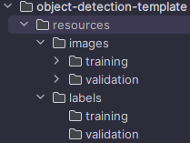

# Object Detection Template
## Overview
This project serves as a wrapper for the [YOLOv8](https://github.com/ultralytics/ultralytics) object detection model developed by [Ultralytics](https://www.ultralytics.com/). 
It provides a simplified interface for both training and using the YOLOv8 model, making it easier for users to integrate YOLOv8 into their projects.

## Credits
This project is based on the [YOLOv8](https://github.com/ultralytics/ultralytics) model developed by [Ultralytics](https://ultralytics.com/). 
I would like to express my gratitude to the Ultralytics team for their outstanding work on YOLOv8, which serves as the backbone for this wrapper project. 
I do not take any credit for this object detection model.

## Licensing
Before using this wrapper project, please make sure to review the licensing terms of YOLOv8, described on their [GitHub page](https://github.com/ultralytics/ultralytics/blob/main/LICENSE).
Ensure that you comply with the terms and conditions specified in the license.

## Getting Started
### Prerequisites
- Python 3.x
- PyTorch (refer to YOLOv8 requirements)
- Other dependencies as specified by YOLOv8 and this wrapper's requirements.txt file

### Installation
1. Clone this repository:
    ```bash
    git clone https://github.com/Maxjuhh123/object-detection-template
    ```

2. Install the required dependencies:
    ```bash
    cd object-detection-template
    pip install -r requirements.txt
    ```

### Setting Up Data
To train an object detection model, you need images with labels. You should have one set of labelled images for training the model,
and one set of labelled images for validating the model. This section will describe how to label and structure your training and validation data.

#### Labelling Data
In order label the data you should draw bounding boxes around the objects in the images. A tool I like using for this is [CVAT](https://www.cvat.ai/), as you can
directly export the labels to YOLO 1.1 format. This means that for each image, we will have a .txt file with the same name.

#### Structuring Data
Having the correct directory structure for your data is highly important. For this project to be able to read your training and validation data I recommend the following structure:



There is a resources directory to  contain all the project's resources such as images and labels. Then we have an images and labels folder
to contain the images, and labels for the images. Each of these folders is split up into a training and a validation
folder which will contain training and validation data respectively. For each folder I will describe below what it should contain:

- **resources/images/training**: This should contain training images (jpg or png files preferred).
- **resources/images/validation**: This should contain validation images (jpg or png files preferred).
- **resources/labels/training**: For each image in `resources/images/training`, this should contain a `.txt` file with the same name, defining the bounding boxes
of objects in the image. Each line in this file describes a bounding box. The bounding box is described by a class (as a number), the coordinates of
the center, the width, and the height of the bounding box. The last 4 points are defined as decimals (between 0 and 1) which describe pixel coordinates/distances
relative to the input image size.
- **resources/labels/validation**: For each image in `resources/images/validation`, this should contain a `.txt` file with the same name, defining the bounding boxes
of objects in the image in the same way as the labels for the training set.

### Usage
#### Training
To train your model, there is one file you should adjust. In the resources directory, you should change the following things in your `training-config.yaml` file:
1. The `path` variable should give an absolute path to your `resources` directory.
2. The `names` variable should map the numbers of your labels to the names.

After this has been done you can run the `train.py` file with the `--epochs` argument to determine the amount of epochs used for training. An example of how to run the training is given below:
1. Open this project's root in a command terminal with python installed.
2. Run (you can change the number of epochs): 
   ```bash
   python src/train.py --epochs 10
   ```
   It could be that the training process fails. If this is the case, try to lower the number of epochs. If this does not work it is recommended to check if your GPU supports CUDA.
   Lastly, you should validate whether your dataset configuration is correct as described above.
3. When the training process is finished, it should show you where the training results were saved. 
   Example: `Results saved to C:\...\runs\detect\train1`
4. In these obtained results you should be able to find a `weights` folder. This folder contains a `best.pt` file. You should copy this `best.pt` file to your `resources` directory.

#### Detecting Objects
Now to actually detect the objects we can execute the `main.py` file. If you look at this file, the input is a path to the image you want to use as an example (relative to the project root).
The output is stored in a variable called detected_objects. An example where I execute this `main.py` file from the project root is described below:
1. I have an image called `example.jpg` in the `resources` directory. 
2. I open a terminal with python installed in the project root.
3. I execute the following command:
   ```bash
   python src/main.py --file_path resources/example.jpg --confidence_threshold 0.8
   ```
   - The `file_path` argument lets us define the file path to the input image.
   - The `confidence_threshold` argument allows us to determine the confidence score threshold that will be used by the model.
   

   In this template, I simply show the image and the bounding boxes drawn in them using the `cv2` package, but you can take
   look at the visualization code in the visualization package to see how you can manipulate the results obtained from the
   object detection model.

#### Validation
If you wish to know how well your model performs, you can look at the confusion matrix which is located in the same `detect` folder as 
the folder where we got the `weights` folder from.
